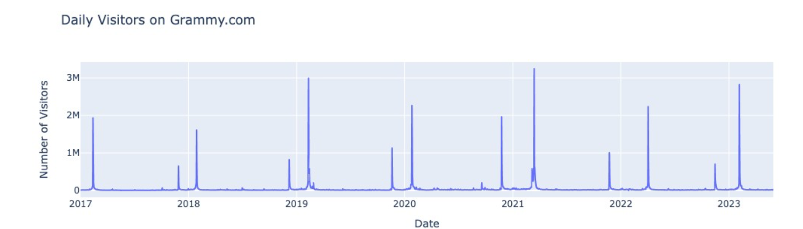
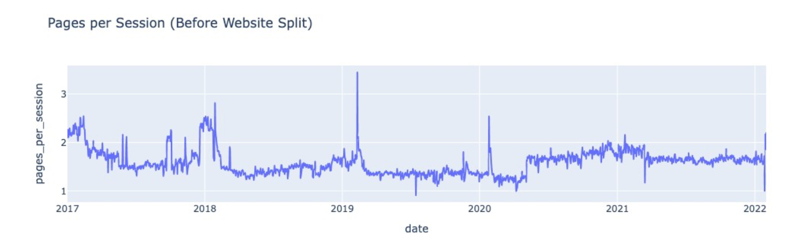
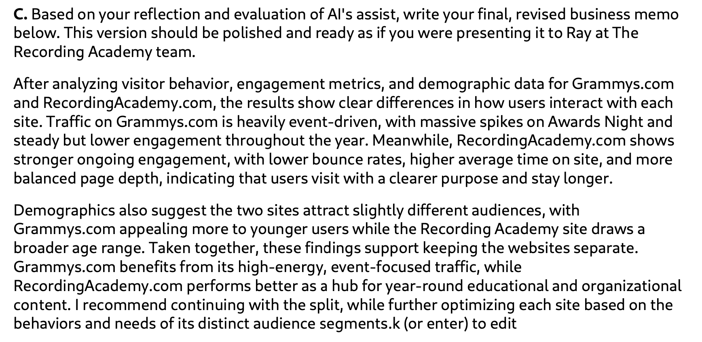

## Key Result
This analysis shows that Grammys.com traffic is highly event-driven with sharp spikes during major events, while RecordingAcademy.com maintains more consistent user engagement, supporting the decision to keep the platforms separate.

# Analyzing Website Performance for The Grammys

## Overview
This project analyzes web analytics data for Grammys.com and RecordingAcademy.com to evaluate the impact of splitting the websites into separate domains. The analysis focuses on traffic patterns, user engagement, and audience behavior.

## Objectives
- Compare website performance before and after the 2022 site split  
- Analyze engagement using pages per session, bounce rate, and session duration  
- Identify major traffic spikes and trends  
- Evaluate audience demographics and device usage  
- Provide a data-driven recommendation  

## Tools Used
- Python  
- pandas  
- Plotly  
- Jupyter Notebook  

## Key Findings
- Awards Night caused the largest traffic spikes  
- Significant increase in user activity during key events  
- RecordingAcademy.com showed stronger engagement metrics  
- Mobile devices made up the majority of traffic  
- User behavior differed between the two sites  

## Business Recommendation
The data supports maintaining separate platforms. Grammys.com is optimized for event-based traffic, while RecordingAcademy.com performs better as a year-round content hub.

## Repository Structure
 README.md ,
 notebooks/ ,
 images/ ,
 data/

## Skills Demonstrated
- Data analysis and validation  
- Problem solving and troubleshooting  
- Data visualization  
- Technical documentation  
- Translating data into business insights  

## Visual Analysis

### Data Preparation
Initial data exploration and preprocessing using Python (pandas) to clean and structure website analytics data.

### Engagement Analysis
Line chart visualization of pages per session showing trends in user engagement over time.

### Key Insights
Analysis shows Grammys.com traffic is highly event-driven, while RecordingAcademy.com maintains more consistent engagement, supporting the decision to keep the platforms separate.

